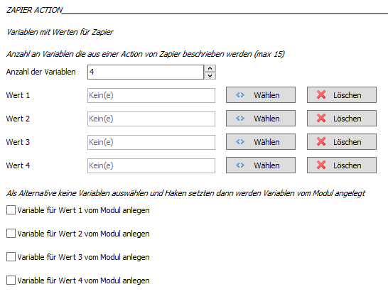

# IPSymconZapier

Modul für IP-Symcon ab Version 4.1 ermöglicht die Kommunikation mit dem Dienst Zapier.

## Dokumentation

**Inhaltsverzeichnis**

1. [Funktionsumfang](#1-funktionsumfang)  
2. [Voraussetzungen](#2-voraussetzungen)  
3. [Installation](#3-installation)  
4. [Funktionsreferenz](#4-funktionsreferenz)  
5. [Konfiguration](#5-konfiguration)  
6. [Anhang](#6-anhang)

## 1. Funktionsumfang

Der Internet Dienst Zapier bietet die Möglichkeit verschiedene Internetdienste miteinander zu verknüpfen
und so Arbeitsabläufe zu erstellen, genannt Zaps. Es lassen sich auch mehrere Dienste in Reihe verknüpfen.
Das Modul bindet Zapier an IP-Symcon an. Es können Zaps in Zapier von IP-Symcon getriggert werden als auch
Daten aus einem Zap in Variablen in IP-Symcon geschrieben werden. Es sind in IP-Symcon bis zu 15 Variablen
definierbar die einen Zap triggern bzw. aus Zapier beschreiben werden können. Auf dieser Weise lassen sich
Kanäle von Zapier mit IP-Symcon 4 verknüpfen.

[Zapier](https://zapier.com "Zapier")


## 2. Voraussetzungen

 - IPS 4.1
 - IP-Symcon Connect
 - Account bei [Zapier](https://zapier.com "Zapier")

## 3. Installation

### a. Laden des Moduls

  Wir wechseln zu IP-Symcon (Ver. 4.1) und fügen unter Kerninstanzen über _*Modules*_ -> Hinzufügen das Modul hinzu mit der URL
```
git://github.com/Wolbolar/IPSymconZapier.git
```	 

### b. Einrichtung in IPS

In IP-Symcon wird von jeden Zap den wir triggern wollen eine seperate Instanz angelegt. Der Zapier IO und Zapier Splitter wird
automatisch mit angelegt. Um die Instanz zu erstellen wechseln wir in die Kategorie, unter der wir die Instanz platzieren wollen
und erstellen mit *CTRL+1* eine neue Instanz.


Über _**Zapier**_ finden wir die Instanz und mit weiter und Ok wird diese angelegt.

##### Auswahl der Kommunikation und Anzahl der Variablen
Es gibt die Möglichkeit aus IP-Symcon herraus einen Zap zu triggern als auch die Möglichkeit Daten von einem Zap an IP-Symcon zu schicken.
Jede IP-Symcon Zapier Instanz steht für ein Event das in Zapier auftritt es können beliebig viele Instanzen angelegt werden.
Nach dem Öffen der Instanz erscheint zunächst eine Abfrage ob die aktuelle Instanz nur zum *Senden*, *Empfangen* oder zum *Senden/Empfangen* dienen soll.


Nachdem die passende Auswahl getroffen wurde bestätigen wir mit _Übernehmen_ anschließend **schließen wir die Instanz** und öffnen diese dann erneut.
Ab der neusten Version von IP-Symcon 4.1 ist kein Schließen der Instanz mehr notwendig.

Nun haben wir je nach vorheriger Auswahl weitere Optionen. 


Da es unzählige Zaps und damit unzählige Möglichkeiten gibt was von Zapier an IP-Symcon geschickt werden kann, je nachdem welchen Zap
man verwendet, muss pro angelegter Instanz vom Nutzer festgelegt werden vielviele Variablen von Zapier erwartet werden. 

Nachdem die passende Anzahl der Variablen selektiert wurde bestätigen wir mit _Übernehmen_ anschließend **schließen wir die Instanz** und öffnen diese dann erneut.
Ab der neusten Version von IP-Symcon 4.1 ist kein Schließen der Instanz mehr notwendig.

##### Festlegen der Variablen oder Konstanten

###### Konfiguration Trigger Webhook (Senden an Zapier)

Zapier Modul Trigger 


Im Bereich Senden an Zapier haben wir die Auswahl ob wir eine existierende Variable benutzen wollen. Dann wählen wir diese bei _Variablen mit Werten für Trigger Zapier_ aus.
Bei den Variablenzuweisung ist darauf zu achten das der gewählte Variablentyp dem zu erwartenden Wert aus Zapier entspricht, ansonsten werden die Daten nicht abgelegt.  

Wenn wir eine Konstante einem Wert den wir an Zapier schicken wollen zuweisen wollen lassen wir das Feld zum Variablen auswählen leer und kreuzen _Modul Wert nutzen_ an und tragen
dann den Wert in das dazugehörige Feld ein. Dann legt das Modul beim ersten Eintreffen von Daten in der Instanz in IP-Symcon die Variablen passend zum Variablentyp der Daten an.

Wichtig ist nur das die Anzahl der Variablen mit der Anzahl der an Zapier versendeten Daten im Zap übereinstimmt. Die maximale Anzahl an Variablen, die das Modul zur Zeit verwaltet liegt
bei 15. Sollte es dennoch Zaps geben die mehr Variablen benötigen kann dies zukünftig aber auch noch erhöht werden. 

###### URL Feld beim Versenden
Um Daten an Zapier senden zu können müssen wir im Modul einen URL eintragen, um diese zu erhalten müssen wir zunächst mit der Konfiguration eines Zap in Zapier fortfahren.

###### Konfiguration Aktion Webhook (Empfangen von Zapier)

Zapier Modul Aktion




Im Bereich Empfang von Flow haben wir die Auswahl ob wir eine existierende Variable benutzen wollen. Dann selektieren wir die passende Variable im Auswahlfeld. Wenn noch keine Variable
haben könne wir auch _Variable für Wert vom Modul anlegen_ auswählen. Das Modul legt dann passend zum den ankommenden Daten von Flow eine Vraiable des entsprechnden Variablentyps an.
Wichtig ist nur das die Anzahl der Variablen mit der Anzahl der von Zapier versendeten Daten übereinstimmt. Die maximale Anzahl an Variablen, die das Modul zur Zeit verwaltet liegt
bei 15. Sollte es dennoch Zaps geben die mehr Variablen benötigen kann dies zukünftig aber auch noch erhöht werden. 


### c. Konfiguration von Zapier

Wir melden uns bei [Zapier](https://zapier.com "Zapier") an erstellen einen neuen Zap mit


Abhänig davon ab wir Daten an Zapier schicken wollen oder von Zapier Daten erhalten wollen gehen wir nun unterschiedlich vor.

#### Anlegen eines Webhook für den Empfang in Zapier von IP-Symcon
Wenn wir Daten an Zapier verschicken wollen müssen wir nun in Zapier einen Webhook als Trigger für einen Zap erstellen. Nachdem wir im Modul ja festgelegt haben wieviele Variablen bzw. Werte
wir benötigen könne wir nun den Webhook in Zapier erstellen.

Als Trigger wählen wir Webhook


Bei _Choose a Trigger_ wählen wir _Catch Hook_ 


Bei _Pick of a Child Key_ tragen wir _**IPS4**_ ein


Nun müssen wir den Webhook testen.


Dazu kopieren wir die URL des Webhook in die Zwischenablage.


Und fügen dies dann in IP-Symcon in das Modul ein und Übernehmen diese Änderung. Wenn nun soweit alles eingetragen wurde und die URL im Modul übernommen wurde können wir nun
aus IP Symcon in der Testumgebung oder im Webfront den soeben erstellten Flow Triggern.


Wenn wir im Webfront eine kurzes Popup Fenster sehen wollen wenn der Zap von Zapier empfangen wurde können wir dies mit einem Haken im Modul ankreuzen.
Nachdem wir den Zap von IP-Symcon getriggert haben gestätigen wir dies in der Webseite von Zapier bei der Erstellung des Webhook. Der Webhook ist nun aktiv nun
kann mit den gewünschten weiteren Aktionen fortgefahren werden. Dabei können dann die Werte von IP-Symcon im Zap in den weiteren Schritten benutzt werden.
Abhänig vom gewählten Modell in Zapier ist es Möglich einen Trigger und eine Aktion zu verküpfen oder aber auch Multizaps zu erstellen. Ein Zap muss mindestens aus einem
Trigger und einer Aktion bestehen.

Hier fahren wir jetzt mit den weiteren Schritten bei der Erstellung des Zaps fort und erstellen diesen dann am Schluss.


#### Einrichtung eines Zap zum Senden an IP-Symcon

Wenn wir über einen Zap Daten an IP-Symcon verschicken wollen erstellen wir zunächst den Zap wie wir ihn benötigen und schließen den Zap dann mit einem Webhook ab.

_Choose an Action App_ wählen wir Webhook


Unter _Create_ wählen wie _**POST**_ aus


Unter _Set up Webhooks by Zapier POST_ tragen wir im Feld _URL_

_**https://ipsymconconnect.ipmagic.de/hook/Zapier**_

ein. Dabei ist die eigene IP-Symcon Connect Adresse einzutragen.


Unter _Data_ tragen wir den _username_ und das _password_ ein. Diese stehen in der Testumgebung des Moduls und können bei Bedarf im Zapier IO abgeändert werden.

Unter _objectid_ tragen wir die ObjektID der Zapier Instanz in IP-Symcon ein an die die Daten aus dem Zap geschickt werden sollen.


Das Modul in IP Symcon erwartet die Daten wie folgt:

| Eigenschaft               | Wert                                                                                        |
| :-----------------------: | :-----------------------------------------------------------------------------------------: |
|_**URL**_                  | IP-Symcon Connect Adresse/hook/Zapier                                                       |
|_**Payload Type**_         | form                                                                                        |
|_**Data**_                 |                                                                                             |                                                                                          |
|_username_                 | Username im IFTTT IO wird auch in der Testumgebung der Instanz angezeigt                    |
|_password_                 | Passwort im IFTTT IO wird auch in der Testumgebung der Instanz angezeigt                    |
|_objectid_                 | ObjektID der IFTTT Zapier Instanz die die Daten entgegen nehmen soll                        |
|_values_                   |{"value1":"value1string","value2":value2boolean,"value3":value3integer,"value4":value4float} |
|_**Wrap Request In Array**_| no                                                            	                          |
|_**Unflatten**_            | yes                                                                                         |

Die Values werden innerhalb der Form als JSON übergeben. Keys sind immer in "" zu setzen ebenso String Variablen.
Integer, Float und Boolean sind keine "" um die Variable zu setzen. In dem Beispiel oben wenn es sich um eine Email
handeln würde wären also alle Variablen vom Typ String und werden in "" gesetzt.
		
Jetzt sollte wenn das Recipe triggert ein Web Request an IP-Symcon über Zapier geschickt werden. Der Inhalt wird in die gewählten Variablen der IFTTT Instanz
abgelegt. Sollten die Auswahl getroffen worden sein das das Modul die Variablen anlegt, so werden diese mit dem ersten Eintreffen von Daten in IP-Symcon
automatisch entsprechend dem Variablentyp der Daten in IP-Symcon angelegt.

Auf die Variablen können wir dann in IP-Symcon ein Ereignis legen das z.B. bei einem bestimmten Wert oder einer Variablenänderung oder Variablenaktualisierung
weitere Dinge in IP-Symcon ausführt. Vielleicht lässt sich auf diese Weise ja noch das ein oder andere in IP-Symcon einbinden für das es derzeit noch keine Skripte
oder Module gibt.
	


## 4. Funktionsreferenz

### Zapier
Im der Zapier Instanz ist einzustellen ob die Instanz nur zum Senden, Empfangen oder Senden/Empfangen
benutzt werden soll. So können für jeden Trigger der in Zapier ausgelöst werden soll Variablen
und Konstanten definiert werden, die beim Auslösen des Events in IP-Symcon an Zapier gesendet
werden.
 
Sendet einen Trigger an den hinterlegten Webhook von Zapier mit den im Modul hinterlegten Variablen.
  
```php
Zapier_TriggerZap(integer $InstanceID)
```   
Parameter _$InstanceID_ __*ObjektID*__ der Zapier Instanz
  
Sendet einen Trigger an Zapier an eine Zapier URL mit Werten.
```php
Zapier_SendZapTrigger(integer $InstanceID, string $zapierwebhook, string $values) 
```    
Parameter _$InstanceID_    _*ObjektID*_ der Zapier Instanz

Parameter _$zapierwebhook_   URL des Zapier Webhooks

Parameter _$values_ 	   Werte als JSON 
    
Für den Empfang von Daten von Zapier können Variablen im Modul ausgewählt werden. Dabei ist darauf
zu achten das der Variablentyp dem von Zapier versendeten Daten entspricht sonst werden keine Daten
abgelegt. Alternativ kann man auch im Modul angeben dass das Modul die Variablen anlegen soll. Die
Variablen werden dann beim ersten Empfangen von Daten von Zapier automatisch entsprechend dem Variablentyp
in IP-Symcon angelegt.  

### Zapier IO
Der Webhook in IP-Symcon ist durch einen Benutzernamen und Passwort abgesichert. Im Zapier IO
kann das vorgegebene Passwort bei Bedarf geändert werden. Der aktuelle Benutzername und das
aktuelle Passwort wird in der Testumgebung der Zapierinstanz angezeigt zur Konfigurationshilfe. 
 

## 5. Konfiguration

### Zapier IO:

| Eigenschaft | Typ     | Standardwert | Funktion                                                |
| :---------: | :-----: | :----------: | :-----------------------------------------------------: |
| username    | string  | 		       | username für Zapier zur Authentifizierung bei IP-Symcon |
| password    | string  |              | password für Zapier zur Authentifizierung bei IP-Symcon |

username und password sind vorab eingestellt können aber individuell angepasst werden.

### Zapier:  

| Eigenschaft      | Typ     | Standardwert| Funktion                                                    |
| :--------------: | :-----: | :---------: | :---------------------------------------------------------: |
| zapierwebhook    | string  |             | URL des Zapier Webhooks an den der Trigger geschickt wird   |
| selection        | integer |      0      | Konfigurationsauswahl 1 Senden, 2 Empfang, 3 Senden/Empfang |
| countrequestvars | integer |      0      | Anzahl der Variablen die von Zapier beschrieben werden      |
| countsendvars    | integer |      0      | Anzahl der Variablen die an Zapier gesendet werden sollen   |
| zapierreturn     | boolean |    false    | Anzeige im Webfront wenn Trigger ausgelöst wurde            |
| varvalue 1-15    | integer |      0      | ObjektID einer Variable                                     |
| modulinput 1-15  | integer |      0      | Aktivieren für Modulkonstante statt Variable                |
| value 1-15       | string  |      0      | Konstante kann als Wert im Modul hinterlegt werden          |
| requestvarvalue  | integer |    false    | ObjektID einer Variable                                     |
| modulrequest     | string  |    false    | statt eigener Variable wird eine Variable vom Modul angelegt|


## 6. Anhang

###  a. GUIDs und Datenaustausch:

#### Zapier IO:

GUID: `{7E03C651-E5BF-4EC6-B1E8-397234992DB4}` 


#### Zapier:

GUID: `{C45FF6B3-92E9-4930-B722-0A6193C7FFB5}` 


